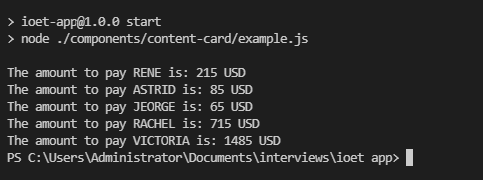
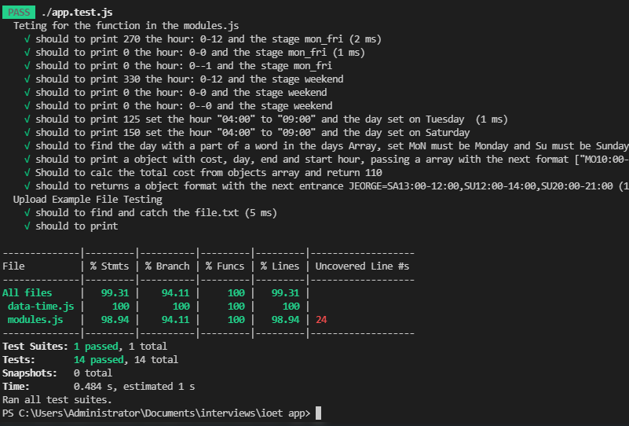

# Getting Started with Create React App

## Available Scripts

In the project directory, run this scripts for start the App :

1. Clone the project:
   `CLONE`

```terminal
git clone https://github.com/geovannyC/ioet-console-app-test-interview
```

2. Install dependences:
   `INSTALL`

```terminal
npm install
```

3. Launch the project:
   `START`

```terminal
npm run start
```

Runs the app in the development mode.\
Open [http://localhost:3000](http://localhost:3000) to view it in your browser.

4. Launcher the test runner:
   `TEST`

```terminal
npm run test
```

<details><summary>Architecture</summary>

```
IOET
├── README.md
├── package-lock.json
├── package.json
│── components
│    ├── content-card
│    │   ├── example.js
│    │   ├── data-time.js
│    │   └── modules.js
│── example-files
│    ├── file.txt
│    ├── file1.txt
│    ├── file2.txt
│    ├── file3.txt
│    ├── file5.txt
│    └── file4.txt
└── screenshots
	 ├── test.png
     └── console.png
```

</details>
     
<div align="center">
	<h1 >Intewview App</h1>
		
</div>
<div align="center">
	<h2 >Test</h2>
		
</div>
